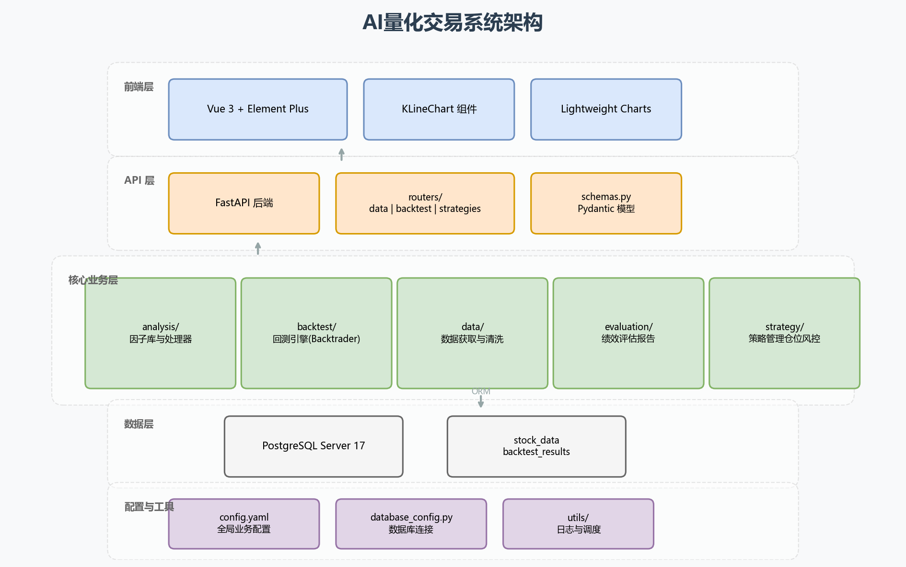

# AI量化交易系统 (AI-Quant-Trading)

这是一个基于 Python 和 Vue 3 的全栈量化交易系统，集成了数据获取、策略回测（如网格交易、均线牛熊策略）、指标计算和 Web 可视化界面。

> **核心原则：**
>
> 1. 项目强制使用 **PostgreSQL Server 17** 作为唯一数据库后端。
> 2. 严禁使用任何模拟数据，所有数据必须先入库后使用。
> 3. 测试脚本必须放在 `tests` 目录下，且使用完毕后必须删除。
> 4. 所有代码注释和文档必须使用中文。

## 系统架构图



> 📊 架构图说明：展示系统五层架构（前端层、API 层、核心业务层、数据层、配置与工具层）

## 项目结构

```text
AI量化999/
├── api/                    # FastAPI 后端路由与 Schema 定义
│   ├── routers/            # 各业务路由 (backtest, data 等)
│   └── schemas.py          # Pydantic 数据验证模型
├── app.py                  # FastAPI 后端服务主入口
├── core/                   # 核心量化业务逻辑模块
│   ├── analysis/           # 因子库与因子处理器
│   ├── backtest/           # 回测引擎与具体策略实现 (基于 Backtrader)
│   ├── data/               # 数据库 ORM (PostgreSQL) 与数据获取清洗
│   ├── evaluation/         # 回测报告生成 (Markdown) 与绩效指标计算
│   └── strategy/           # 策略管理、仓位管理与风险控制
├── frontend/               # Vue 3 + Element Plus 前端可视化界面
│   ├── src/                # 前端源码
│   │   ├── components/     # Vue 组件 (KLineChart, SymbolSelector, BacktestUniversal 等)
│   │   └── services/       # API 服务封装
│   ├── lightweight-charts-master/  # TradingView Lightweight Charts K线图可视化库
│   │   ├── src/            # 库核心源码 (图表API、数据模型、渲染引擎等)
│   │   ├── indicator-examples/     # 指标示例 (移动平均、动量、相关性等)
│   │   ├── plugin-examples/        # 插件示例 (工具提示、热力图、趋势线等)
│   │   └── packages/       # 插件开发工具包与模板
│   └── package.json        # 前端依赖配置
├── config/                 # 配置文件
│   ├── config.yaml         # 全局业务配置
│   └── database_config.py  # 数据库连接配置
├── utils/                  # 通用工具函数 (日志、调度等)
├── data/                   # 数据暂存区 (抓取的原始历史数据文件等)
├── reports/                # 自动生成的回测 Markdown 报告存放目录
├── .trae/                  # IDE 技能工作流脚本与提示词
└── requirements.txt        # Python 后端依赖列表
```

## 环境要求与配置

### 1. 数据库准备 (核心要求)

- 必须安装并运行 **PostgreSQL Server 17**。
- 本项目默认采用 **配置文件优先** 的密码读取方式，适用于本地数据库明文配置场景。
- 推荐直接在 `config/config.yaml` 的 `database.postgres.password` 中填写本地数据库密码。
- 若配置文件未填写密码，系统会继续尝试读取 `PGPASSWORD` 等环境变量。
- 系统会自动连接并创建所需的行情表、配置表及交易记录表。

### 2. 后端环境 (Python)

1. 确保安装 Python 3.8+。
2. 激活虚拟环境并安装依赖：
   ```powershell
   # Windows PowerShell
   .venv\Scripts\Activate.ps1
   pip install -r requirements.txt
   ```

### 3. 前端环境 (Node.js)

1. 确保安装 Node.js (推荐 v16+)。
2. 进入前端目录并安装依赖：
   ```bash
   cd frontend
   npm install
   ```

## 快速开始

### 1. 启动后端 API 服务

在项目根目录，确保虚拟环境已激活，并已在 `config/config.yaml` 中配置数据库密码：

**方式一：配置文件优先启动（本地推荐）**

```powershell
# 激活虚拟环境
.venv\Scripts\Activate.ps1

# 启动 FastAPI 服务
python app.py
```

> 默认读取 `config/config.yaml` 中的 `database.postgres.password`。

**方式二：环境变量方式启动（备用）**

```powershell
$env:PGPASSWORD="wy123456"; .\.venv\Scripts\python.exe app.py
```

**方式三：使用 uvicorn 直接启动**

```powershell
uvicorn app:app --host 0.0.0.0 --port 8000 --reload
```

> API 服务默认运行在 `http://localhost:8000`。
> 可通过 `http://localhost:8000/docs` 访问 Swagger 接口文档。
> 可通过 `http://localhost:8000/redoc` 访问 ReDoc 接口文档。

### 2. 启动前端可视化界面

打开一个新的终端，进入 `frontend` 目录：

```bash
cd frontend
npm run dev
```

> 前端页面默认运行在 `http://localhost:5173` 或 `http://localhost:3000` (具体请看控制台输出)。

## 核心功能说明

1. **数据获取与存储**：
   通过 `core.data` 模块从外部数据源抓取股票、指数等数据，统一清洗后存储于 PostgreSQL 中。
2. **策略与回测引擎**：
   基于 `Backtrader` 封装。支持复杂的交易策略（如趋势共振、MA200 牛熊过滤 + MA60 上下穿），并支持全仓买卖模式。
3. **报告生成**：
   回测完成后，系统会在 `reports/` 目录下自动生成详尽的中文 Markdown 报告，包含：
   - 核心绩效指标（总收益、最大回撤、夏普比率、盈亏比等）
   - 每次买卖盈亏时间段清单
   - 最大回撤时间段清单
   - 全量交易流水
4. **前端 K 线与指标展示**：
   前端提供强大的 K 线图展示（基于 `lightweight-charts`），支持以下功能：
   - **MA 均线**：支持 MA5/10/20/30 简单移动平均线，固定颜色展示
   - **EMA 均线**：支持 EMA 动态颜色展示，根据趋势方向自动切换颜色
     - 上升趋势（EMA 上涨）：红色 `#ef4136`
     - 下降趋势（EMA 下跌）：绿色 `#4caf50`
     - 震荡趋势（EMA 平稳）：灰色 `#9e9e9e`
   - **EMA 周期可配置**：支持 5/10/20/30/60 周期切换
   - **后端 EMA API**：通过 `/ema-data` 接口获取 EMA 数据，含方向判断和颜色信号
   - **交易信号叠加**：支持买卖信号点在 K 线图上的叠加展示
5. **因子计算引擎**：
   通过 `core.analysis` 模块提供完整的因子计算能力，包括：
   - 移动平均线（MA、EMA、WMA）
   - 均线交叉信号（金叉/死叉）
   - 多周期均线组合
   - 布林带（基于 EMA 中轨）
   - 动量指标（CMO、Beta、残差动量等）
6. **通用标的选择组件**：
   前端提供 `SymbolSelector` 通用标的选择组件，支持：
   - **自动加载**：从数据库自动获取所有标的（股票/ETF/指数）
   - **类型筛选**：支持按标的类型筛选（stock/etf/index）
   - **搜索功能**：支持按代码或名称模糊搜索
   - **远程搜索**：支持后端 API 远程搜索
   - **类型标签**：不同类型标的使用不同颜色标签区分
   - **组件复用**：可在任何组件中直接调用，方便集成
   - **详细说明**：见 [SymbolSelector 组件说明文档](docs/SymbolSelector_组件说明.md)

## 开发规约

- **无模拟数据**：开发或调试时禁止使用代码硬编码的 mock 数据，请从数据库查询真实行情。
- **中文规范**：新增的任何脚本文件、函数功能说明注释，以及输出的报告与文档，均必须使用中文。
- **测试脚本管理**：测试相关脚本（含临时文件）需建立在 `tests/` 目录下，测试通过后必须清理。

## PostgreSQL 连接与排障

### 1. 密码读取优先级

项目默认使用以下顺序读取 PostgreSQL 密码：

1. `config/config.yaml` 中的 `database.postgres.password`
2. `password_env` 指定的环境变量（默认 `PGPASSWORD`）
3. 通用环境变量 `PGPASSWORD` / `POSTGRES_PASSWORD`

本项目当前按**本地开发场景**配置，允许在 `config/config.yaml` 中明文保存本地数据库密码。

**配置文件方式（当前默认）**

```yaml
database:
  postgres:
    host: "localhost"
    port: 5432
    database: "postgres"
    user: "postgres"
    password: "wy123456"
    password_env: "PGPASSWORD"
```

**环境变量方式（备用）**

```powershell
$env:PGPASSWORD="你的密码"
python app.py
```

### 2. 常见报错排查

- `fe_sendauth: no password supplied`：通常是 `config/config.yaml` 未填写 `database.postgres.password`，且环境变量也未设置。
- `password authentication failed for user "postgres"`：密码不正确，或数据库用户/认证规则不匹配（检查用户名、`pg_hba.conf` 规则）。
- `could not connect to server: Connection refused`：PostgreSQL 服务未启动，或端口/地址不对（默认 `localhost:5432`）。
- `relation "xxx" does not exist`：表不存在；通常是未先执行数据入库或未触发初始化建表流程。

### 3. `trade_count` 自动迁移说明

为保持向后兼容，系统在初始化数据库时会自动补齐 `backtest_results.trade_count` 字段：

- 初始化入口：创建 `Database()` 时执行建表/字段补齐逻辑
- 迁移语句：`ALTER TABLE backtest_results ADD COLUMN IF NOT EXISTS trade_count INTEGER`

如果你之前的库里没有该字段，只要确保 PostgreSQL 连接正常（已设置 `PGPASSWORD`），启动后端或运行一次回测即可自动补齐。
